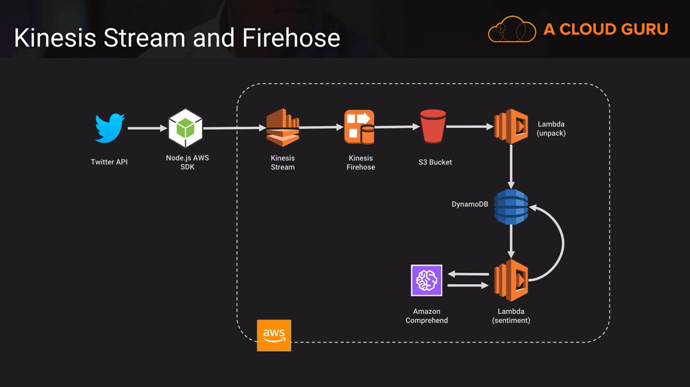

# Does-Twitter-Hate-Cats
Prepared by Scott Pletcher April 2018

Source code & Lesson files for the A Cloud Guru, Maker lab - Does-Twitter-Hate-Cats.
A tongue in cheek exercise in social media mining using text analytics.

Please note, this is provided as-is, A Cloud Guru does not support this code. If you do identify any errors, then please identify and we will attempt to fix on a best efforts basis.

## aCloud.Guru
This file was created for the purposes of the Maker lab - Does-Twitter-Hate-Cats Course from [aCloud.Guru](https://acloud.guru)

## IMPORTANT
These files are distributed on an AS IS BASIS, WITHOUT WARRANTIES OR CONDITIONS OF ANY KIND, either express or implied

## April 2018
Initial creation
## Frameworks
- https://www.npmjs.com/package/twitter-api-v2

## Setup env & Requirements
- install node
- `npm install`
- Twitter Developer Account
- AWS account

## Step guides

#### 1. Create IAM role

##### 1.1) create role (select lambda as a service) with full access of these 7 services

- S3
- CloudWatchLog
- Kinesis
- KinesisFirehose
- DynamoDB
- Comprehend
- Lambda

##### 1.2) After created the role, then edit Trust relationships by adding "firehose.amazonaws.com" as second service in principal section.

#### 2. Create two tables
- rawTweets
    - Partition key: id (S) 
- twitterSentiment
    - Partition key: sentiment (S)

#### 3. Create S3 buckets

#### 4. Create Kinesis
named 'twitterStream'

#### 5. Create Kinesis Firehose
- named 'twitterStreamFirehose' (any name)
- select the existing created IAM role
#### 6. Create two Lambda functions
##### 6.1 unpack
- named 'twitterUnpack'
- select S3 as a triggered using the created bucket
- put code from file 'twitterUnpack.js'
- add Env variable
    - DYNAMODB_TABLE: 'rawTweets'
- Deploy
##### 6.2 sentiment
- named 'twitterUnpack'
- select DynamoDB as a triggered using the 'rawTweets' table with new record events
- put code from file 'twitterSentiment.js'
- add Env variable
    - DYNAMODB_TABLE: 'twitterSentiment'
- Deploy

#### 7. Run node 
- edit configuration in `config.json`
- edit `<Bearer Token>` in `kinesis.js` as your credential from Twitter Developer Account
- (optional) test running Amazon Comprehend `node comprehend.js`
- run `node kinesis.js` to retrieve data from Twitter and put into S3 (each text will be separated by pipe ('|'))
- validate results
    - there were data in S3
    - Both lambda function should be triggered
    - records in DynamoDB should appear
    - Final results are in 'twitterSentiment' table

